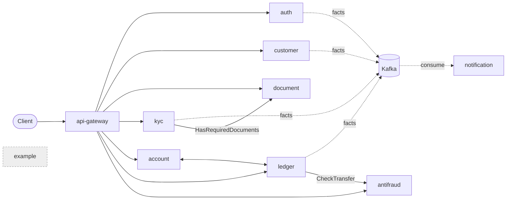

# mini-fintech

Mini-Core — a simplified core banking system (АБС) + KYC, built as a Go microservices
monorepo. Two end-to-end flows are the target:

1. **Onboarding:** register → profile → upload documents → KYC review → approval → account
   auto-opened.
2. **Money transfer:** transfer → antifraud verdict → double-entry ledger → notification.

External systems (sanctions lists, SMS, document OCR) are mocks. The goal is architecture and
correctness, not integrations. See [`tz-abs-kyc.md`](tz-abs-kyc.md) the original requirements.

## Quickstart

```bash
cp .env.example .env     # local, git-ignored
make up                  # start local infrastructure (Postgres, Kafka, Redis, MinIO, ...)
make generate            # regenerate Go from .proto via buf
make test                # fast unit tests (no Docker)
make test-integration    # integration tests via testcontainers
make down                # stop local infrastructure
```

| Target | Purpose |
|---|---|
| `make up` / `make down` | start / stop the local infrastructure via docker-compose |
| `make generate` | regenerate Go from `.proto` via buf |
| `make auth-keygen` | generate the Ed25519 auth dev key (git-ignored) |
| `make migrate` | apply migrations |
| `make lint` | golangci-lint across the workspace |
| `make test` | fast unit tests (no Docker) |
| `make test-integration` | integration tests via testcontainers |
| `make e2e` | end-to-end scenario over docker-compose |
| `make e2e-stage1` | Stage-1 REST smoke test (register → login → profile → RBAC) |

## Architecture



Commands and queries travel over gRPC; facts travel over Kafka. Each service owns its own
database. Stage 1 ships `auth`, `customer` and `api-gateway`; profile creation is
**asynchronous** (driven by the `auth.user_registered` event), so a profile read immediately
after registration can briefly return `404`. Auth serves its JWKS over HTTP on `:8081`;
the gateway is HTTP-only. The `example` service is the copy-and-rename template. Service
responsibilities, both end-to-end flows (onboarding and transfer), the `account` ↔ `ledger`
cycle, and the substrate rationale live in [`docs/architecture.md`](docs/architecture.md). The
REST edge — its surface, error envelope, rate limits, auth and configuration — is documented in
[`services/api-gateway/README.md`](services/api-gateway/README.md).

### Ports

| Component | Port(s) |
|---|---|
| Postgres | 5432 |
| Redis | 6379 |
| Kafka (broker / controller) | 9092 / 9093 |
| MinIO (API / console) | 9000 / 9001 |
| Jaeger UI | 16686 |
| OTel Collector (OTLP gRPC / HTTP) | 4317 / 4318 |
| Prometheus | 9090 |
| Grafana | 3000 |
| `api-gateway` (HTTP only) | 8080 |
| `auth` / `customer` / `kyc` / `document` | 50051 / 50052 / 50053 / 50054 |
| `auth` HTTP/JWKS | 8081 |
| `account` / `ledger` / `antifraud` / `notification` | 50055 / 50056 / 50057 / 50058 |
| `example` (reference template) | 50059 |

If a host port is already in use, remap the left-hand side of the relevant `ports:` entry in
`deploy/docker-compose.yml`; `make up` fails loudly and removes anything it started rather than
leaving a half-started stack. The deliberate simplifications (single Postgres instance,
`account`+`ledger` as one deployment unit, host-only Kafka listener, mocked externals) are listed
in [`docs/architecture.md`](docs/architecture.md#deployment-simplifications-conscious).
